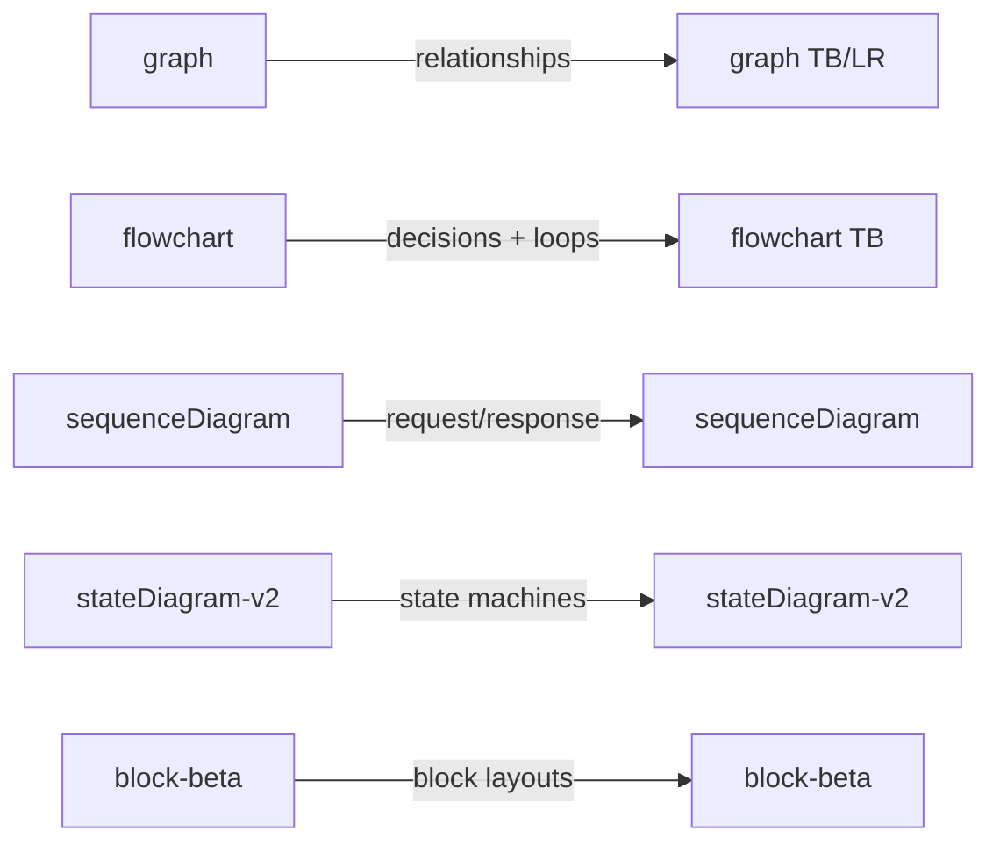
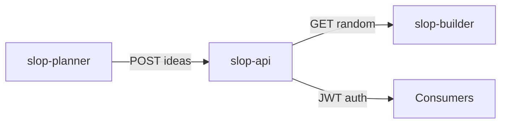
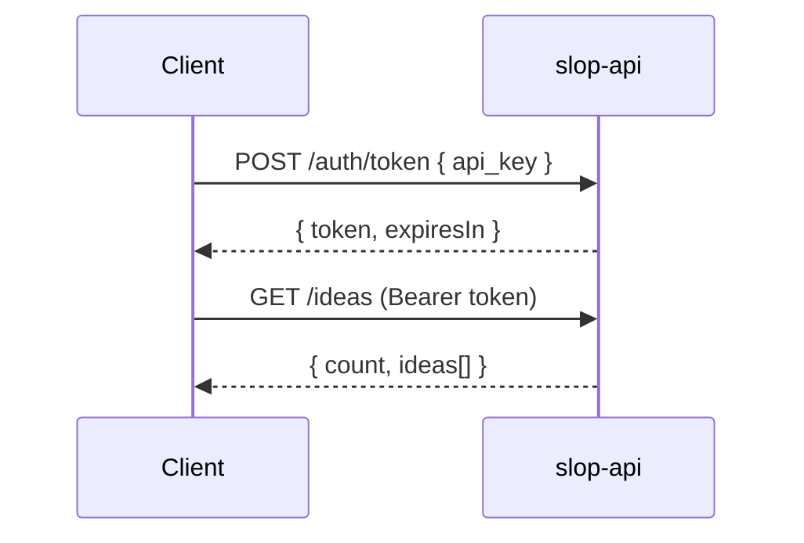
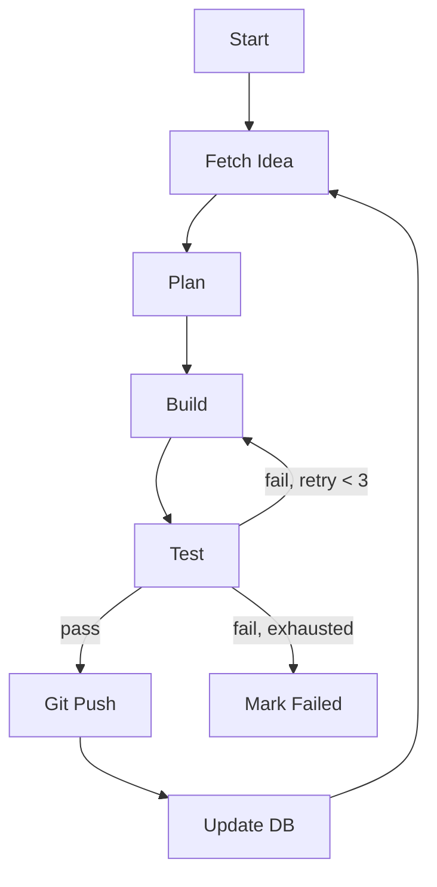

# Mermaid Diagrams — Mandatory

Every documentation file in `docs/` MUST include Mermaid diagrams for visual concepts. Text alone is insufficient for architecture, data flow, and process documentation.

## Core Principle

> If a concept involves relationships, flow, sequence, or structure, it needs a diagram.

Diagrams make documentation scannable, debuggable, and LLM-consumable. A reader should understand the system's shape without reading every paragraph.

## When a Diagram is Required

| Documentation Contains | Diagram Type | Minimum Requirement |
|------------------------|-------------|---------------------|
| Service architecture / components | `graph` or `block-beta` | Show all services and connections |
| Data flow between systems | `flowchart` or `sequenceDiagram` | Show source, destination, and transformation |
| Authentication / request lifecycle | `sequenceDiagram` | Show every round-trip between parties |
| Multi-step agent/workflow loop | `flowchart` | Show each phase, decision points, and loops |
| Branching strategies / git flows | `graph` or `gitGraph` | Show branch relationships and merge direction |
| Tech stack relationships | `graph` | Show which component depends on which |
| Test structure / categories | `graph` | Show hierarchy and relationships |
| State transitions | `stateDiagram-v2` | Show every state and valid transitions |
| Deployment topology | `graph` | Show containers, networks, volumes, ports |

## Diagram Quality Standards

### ✅ DO

- Use ` ```mermaid ` fenced code blocks
- Keep diagrams focused — one concept per diagram
- Label edges with the action or data type (e.g., `-->|POST /api/v1/ideas|`)
- Use `graph LR` for horizontal flows, `graph TB` for top-down hierarchies
- Use `sequenceDiagram` for request/response interactions between named participants
- Use `flowchart` for decision trees and process loops with `{rhombus}` for decisions
- Put diagrams near the text they illustrate, not in an appendix

### ❌ AVOID

- Placeholder diagrams with no content (`A --> B`)
- Diagrams that just repeat a table in visual form
- Overly complex diagrams (more than ~15 nodes — split into sub-diagrams)
- ASCII art diagrams (`┌──┐`) when Mermaid is available
- Diagrams without edge labels when the relationship isn't obvious

## Diagram Types Quick Reference



## Examples

### Architecture (graph)



### Auth Lifecycle (sequenceDiagram)



### Agent Loop (flowchart)



## Enforcement

- Every doc in `docs/` is checked for diagrams on PR review
- Architecture docs without a system diagram are considered incomplete
- ASCII art diagrams must be migrated to Mermaid when the file is next edited
- New docs without diagrams are rejected at review

This rule applies to ALL files under `docs/` at the repo root.
