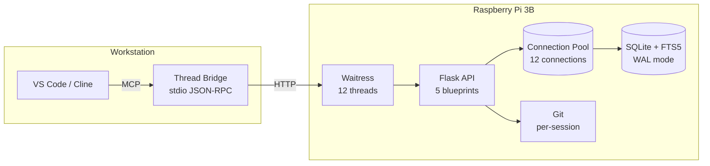

# Thread

[](https://python.org)
[](https://flask.palletsprojects.com/)
[](https://sqlite.org/fts5.html)
[](./tests/)
[](LICENSE)

**Persistent memory for AI coding agents** — a self-hosted context server purpose-built to be as light weight as possible and dependency free. This makes it easy to run on smaller factor and older hardware. Give VS Code Copilot and Cline long-term memory, full-text search, and git-versioned entries across every conversation.

[Overview](#overview) • [Quick Start](#quick-start) • [Features](#features) • [MCP Setup](#mcp-setup) • [Documentation](#documentation) • [Performance](#performance)

---

## Overview

AI coding agents forget everything when you close the chat. Thread fixes that.

It runs a lightweight REST API on your Raspberry Pi (or any machine) with SQLite + FTS5, git versioning, and an MCP bridge. Your agents read/write/search context entries the same way they use any other tool — but the data survives across sessions, projects, and reboots.



**Speed-first design**: 100MB SQLite page cache, 256MB memory-mapped I/O, pre-warmed connection pool, 3-tier in-memory caching. Cache hits <5ms, FTS5 searches <50ms.

## Quick Start

```bash
# Clone and install
git clone https://github.com/your-org/thread.git && cd thread
python3 -m venv .venv && source .venv/bin/activate
pip install -r thread_server/requirements.txt
pip install -r thread_bridge/requirements.txt

# Start the server
.venv/bin/python -m thread_server.server --host 0.0.0.0 --port 5000
```

> [!TIP]
> Use `THREAD_DEBUG=true` for extra diagnostics on `/api/v1/health`.

```bash
# Verify it's running
curl http://localhost:5000/api/v1/health
# → {"status":"ok","timestamp":"...","version":"0.1.0"}

# Create a session and an entry
curl -X POST http://localhost:5000/api/v1/sessions \
  -H "Content-Type: application/json" \
  -d '{"name":"demo","description":"Demo project"}'

curl -X POST http://localhost:5000/api/v1/sessions/demo/entries \
  -H "Content-Type: application/json" \
  -d '{"content":"Thread uses SQLite FTS5 for ranking","priority":8,"tags":["architecture","database"]}'

# Full-text search
curl "http://localhost:5000/api/v1/sessions/demo/search?q=ranking"
```

## Features

### Why Thread?

- **Agents that remember**. Copilot and Cline reset every session. Thread gives them persistent memory — your preferences, project decisions, and hard-won debugging insights carry forward automatically.
- **Feed it your own documents**. Drop in markdown notes, plain-text logs, JSON exports, or any `.md`/`.txt`/`.json` file — Thread auto-chunks them into searchable entries. Point the CLI import tool at a directory and walk away.
- **Runs on anything**. Zero external dependencies beyond Python and SQLite (both built into Raspberry Pi OS). A Pi 3B with 1GB RAM handles it comfortably. No Docker, no Postgres, no cloud bill.
- **Instant full-text search**. Every word across every entry in every session is indexed with FTS5. Prefix queries, phrase matching, boolean negation — find anything in under 50ms.
- **Git-backed history**. Every create, update, and delete commits to a per-session git repo. Roll back mistakes, audit what changed, or diff your agent's context over time.
- **You own your data**. Self-hosted on your own hardware. No SaaS, no telemetry, no API keys. The database is a single SQLite file you can back up with `scp`.
- **Works with your existing tools**. MCP bridge for VS Code Copilot and Cline. REST API for curl, scripts, or custom integrations. No new workflow to learn.

### Core API
- **Full CRUD** — Sessions and entries with cursor pagination
- **FTS5 Search** — BM25 relevance ranking, prefix queries, phrase matching, boolean negation
- **Bulk operations** — Create up to 100 entries in one call, partial failure reporting (207 Multi-Status)
- **Document ingestion** — Upload `.md`/`.txt`/`.json` files and auto-chunk by headings or paragraphs
- **Performance stats** — `/api/v1/stats` with pool utilization, cache hit rates, p99 latency

### Performance
- **Pre-warmed connection pool** — 12 thread-local SQLite connections, zero startup query latency
- **3-tier caching** — Session LRU (95%+ hit rate), search cache (5s TTL), tag cache (30s TTL)
- **WAL mode** — Writers never block readers, concurrent read throughput scales with threads

### Data Integrity
- **Git versioning** — Auto-commit on every mutation with meaningful messages (`session(demo): added entry(42)`)
- **Atomic writes** — Write lock held only for INSERT/UPDATE/DELETE (~1-5ms), never during reads

### AI Agent Integration
- **MCP bridge** — Stdio JSON-RPC bridge for VS Code Copilot and Cline (12 tools)
- **Auto-init sessions** — Default session created the moment your agent connects
- **Auto-context skill** — Portable `.github/skills/thread-auto-context/` that tells agents to save context automatically without being asked

## MCP Setup

Thread becomes your agent's memory with a 2-line config change. **Sessions auto-init on connect** — no manual setup.

### VS Code Copilot

Copy `.vscode/mcp.example.json` → `.vscode/mcp.json` and fill in your paths:

```json
{
  "servers": {
    "thread": {
      "type": "stdio",
      "command": "/path/to/thread/.venv/bin/python",
      "args": ["-m", "thread_bridge.bridge"],
      "cwd": "/path/to/thread",
      "env": {
        "THREAD_SERVER_URL": "http://localhost:5000",
        "THREAD_DEFAULT_SESSION": "copilot"
      }
    }
  },
  "inputs": []
}
```

### Cline

Add to `~/.cline/mcp_settings.json`:

```json
{
  "mcpServers": {
    "thread": {
      "command": "/path/to/thread/.venv/bin/python",
      "args": ["-m", "thread_bridge.bridge"],
      "cwd": "/path/to/thread",
      "env": {
        "THREAD_SERVER_URL": "http://localhost:5000",
        "THREAD_DEFAULT_SESSION": "cline"
      },
      "alwaysAllow": [
        "thread_search",
        "thread_read_entries",
        "thread_list_sessions",
        "thread_get_tags"
      ]
    }
  }
}
```

### Automatic context saving

Once connected, copy [`.github/skills/thread-auto-context/`](./.github/skills/thread-auto-context/) to your project's `.github/skills/` folder. Your agent will automatically:

- Search Thread for relevant past context at session start
- Save important decisions, preferences, and constraints as you work
- Save a summary when you're done

**Without the skill**: you must ask explicitly. **With it**: context saving is fully automatic.

> [!NOTE]
> Full setup guides: [VS Code Copilot](./docs/MCP-VSCODE-COPILOT.md) • [Cline](./docs/MCP-CLINE.md)

## Documentation

| Document | What it covers |
|----------|---------------|
| [`docs/ARCHITECTURE.md`](./docs/ARCHITECTURE.md) | System design, threading model, caching layers, deployment topology |
| [`docs/API-USAGE.md`](./docs/API-USAGE.md) | Every endpoint — request/response shapes, error codes, curl examples |
| [`docs/TECH-STACK.md`](./docs/TECH-STACK.md) | Dependencies, versions, rationale, memory budget |
| [`docs/DEPLOYMENT.md`](./docs/DEPLOYMENT.md) | Raspberry Pi setup, systemd service, firewall, troubleshooting |
| [`docs/CONVENTIONS.md`](./docs/CONVENTIONS.md) | Coding conventions, naming, patterns, VS Code metadata layout |
| [`docs/MCP-VSCODE-COPILOT.md`](./docs/MCP-VSCODE-COPILOT.md) | Full VS Code Copilot MCP integration guide |
| [`docs/MCP-CLINE.md`](./docs/MCP-CLINE.md) | Full Cline MCP integration guide |
| [`AGENTS.md`](./AGENTS.md) | Project rules for contributors |

## Performance

| Operation | p50 | p99 |
|-----------|-----|-----|
| Session lookup (cached) | <1ms | <3ms |
| Entry read by ID | <2ms | <5ms |
| Entry list (50, session) | <5ms | <15ms |
| FTS5 search (cached) | <2ms | <5ms |
| FTS5 search (uncached) | <15ms | <50ms |
| Batch read (10 entries) | <5ms | <15ms |

**Memory**: ~90-110MB RSS at idle, ~160-195MB under load — well within the Pi 3B's 1GB.

## Requirements

| Component | Version | Notes |
|-----------|---------|-------|
| Python | 3.11+ | Standard on Pi OS Bookworm |
| SQLite | 3.40+ | FTS5 + JSON1 extensions (built-in) |
| Flask | 3.x | `pip install -r thread_server/requirements.txt` |
| Waitress | 3.x | Production WSGI, 12 threads |
| requests | 2.31+ | Bridge only, `pip install -r thread_bridge/requirements.txt` |
| Git | any | For per-session versioning (optional — server runs without it) |

## Running on a Pi

```bash
# The deploy directory has everything:
deploy/
├── setup.sh          # One-shot Pi setup script
└── thread.service    # systemd unit file

# Copy to Pi and run setup:
rsync -av --exclude '.venv' --exclude '__pycache__' \
  thread_server/ deploy/ pi@<pi-ip>:~/thread-server/
ssh pi@<pi-ip>
cd ~/thread-server && sudo THREAD_DIR=$PWD ./deploy/setup.sh
```

Server starts on boot via systemd, restarts on crash, and logs to journald. See [`docs/DEPLOYMENT.md`](./docs/DEPLOYMENT.md) for the full guide.

MIT
