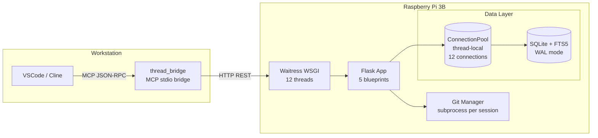
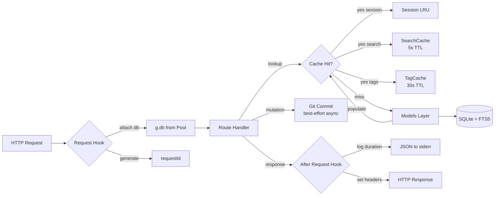
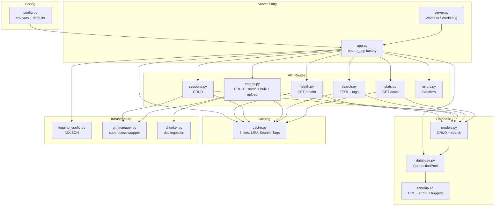
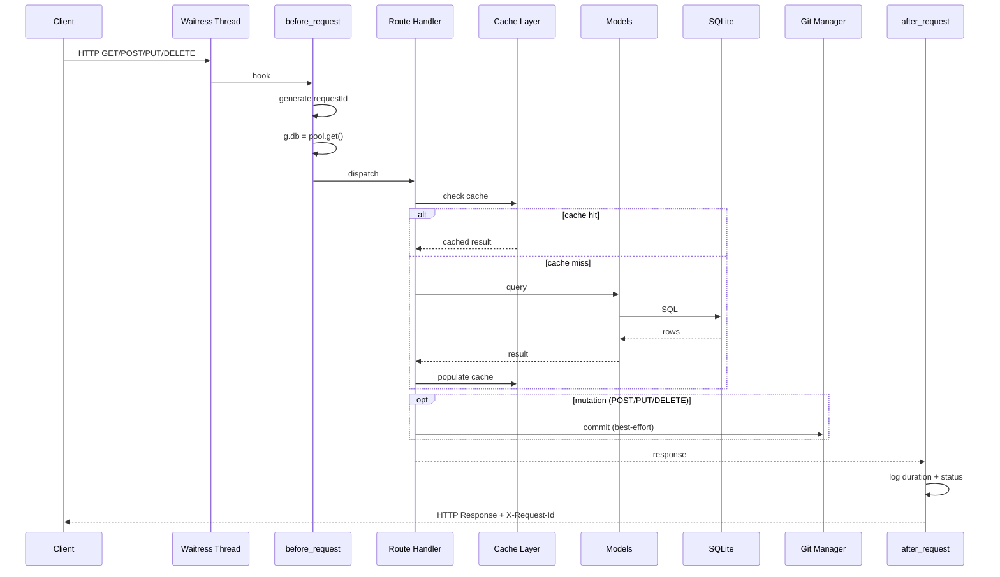
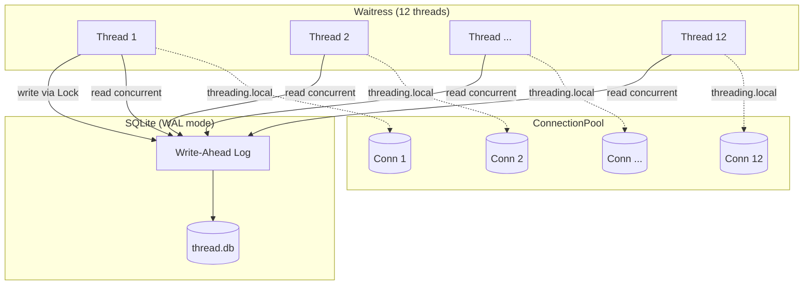
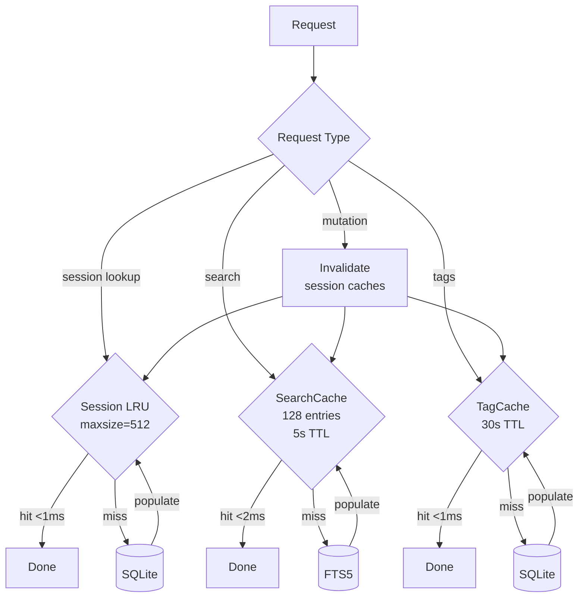
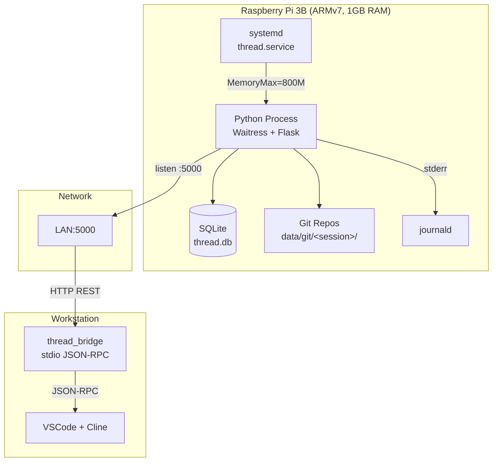
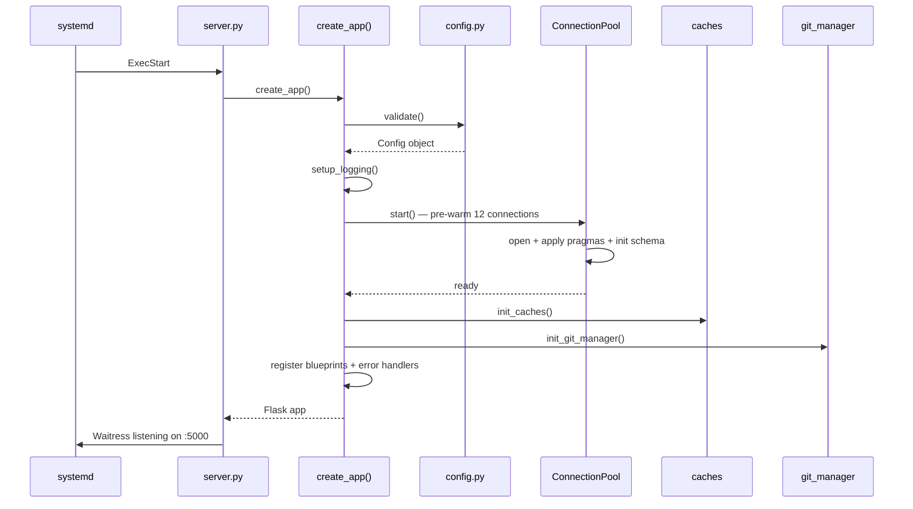

# Thread — Architecture

## System Topology

## Data Flow

## Component Diagram

## Request Lifecycle

## Threading Model

**Key**: Each thread has a dedicated SQLite connection (`threading.local()`). Reads are fully concurrent (WAL mode). Writes serialize through a single `threading.Lock` held only for the duration of the INSERT/UPDATE/DELETE (~1-5ms). Readers never block on writers.

## Caching Architecture

All caches are in-process, pure Python, no external dependency. Cache invalidation is write-through: after any mutation (create/update/delete entry/session), all caches for that session are cleared.

## Deployment Topology

## Startup Sequence

