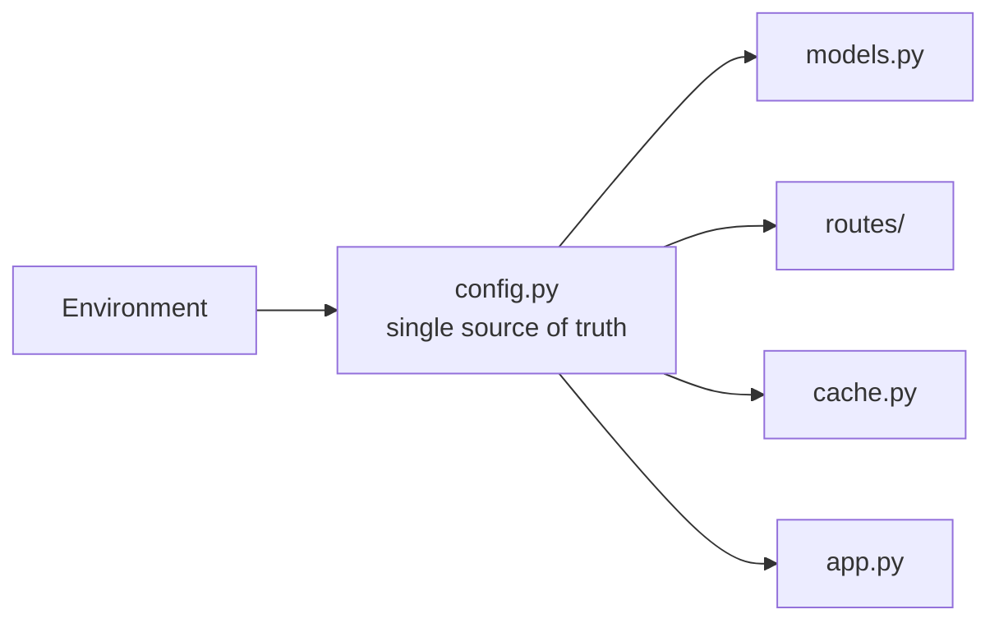
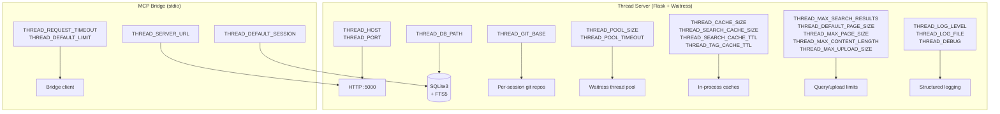

# Thread — Environment Variables

> **Every config value lives in one place, is documented here, and is set via environment variable.**
> No hardcoded limits, no scattered `os.environ` calls. If you add a new config value, document it here.

---

## Server Configuration

These are set in the Thread server's environment (Docker container, systemd unit, or `.env` file).
Defaults work for local development. For production or high-volume use, tune the limits.



### Networking

| Variable | Default | Valid | Description |
|----------|---------|-------|-------------|
| `THREAD_HOST` | `0.0.0.0` | Any IP | Interface to bind the HTTP server to |
| `THREAD_PORT` | `5000` | 1–65535 | Port the HTTP server listens on |

### Storage

| Variable | Default | Valid | Description |
|----------|---------|-------|-------------|
| `THREAD_DB_PATH` | `data/thread.db` | Absolute or relative path | SQLite database file location. Created if missing. |
| `THREAD_GIT_BASE` | `data/git/` | Absolute or relative directory | Root directory for per-session Git tracking repos. Created if missing. |

### Logging & Debug

| Variable | Default | Valid | Description |
|----------|---------|-------|-------------|
| `THREAD_LOG_LEVEL` | `INFO` | `DEBUG`, `INFO`, `WARNING`, `ERROR`, `CRITICAL` | Structured JSON log level. `DEBUG` includes per-request details. |
| `THREAD_LOG_FILE` | `""` (stderr) | Path or empty | Log file path. Empty or unset = write to stderr (Docker/systemd capture). |
| `THREAD_DEBUG` | `false` | `true`, `1`, `yes`, `false`, `0`, `no` | Enable Flask debug mode (auto-reload, stack traces in responses). Never use in production. |

---

## Thread Pool

Waitress uses native threads (one per worker). SQLite connections are pooled separately.

| Variable | Default | Valid | Description |
|----------|---------|-------|-------------|
| `THREAD_POOL_SIZE` | `12` | ≥ 1 | Number of WSGI worker threads. Each handles one HTTP request. |
| `THREAD_POOL_TIMEOUT` | `10` | > 0 (seconds) | Max seconds a thread waits for a database connection before erroring. |

**Tuning guide:**
- **Raspberry Pi (1GB RAM)**: `THREAD_POOL_SIZE=6` — 6 threads × ~15MB SQLite = ~90MB
- **Workstation/Laptop**: `THREAD_POOL_SIZE=12` — default, handles bursty agent traffic
- **Heavy concurrent agents**: `THREAD_POOL_SIZE=24` — needs ~300MB+ for SQLite page cache

---

## Caching

Thread has three in-process caches (no Redis, no memcached). All use stdlib — zero pip dependencies.

| Variable | Default | Valid | Description |
|----------|---------|-------|-------------|
| `THREAD_CACHE_SIZE` | `512` | ≥ 1 | Max session name→id mappings cached (LRU eviction). 95%+ hit rate. |
| `THREAD_SEARCH_CACHE_SIZE` | `128` | ≥ 1 | Max cached FTS5 search results. Agents re-search same terms within seconds. |
| `THREAD_SEARCH_CACHE_TTL` | `5` | ≥ 0 (seconds) | How long search results stay cached. 0 = disable cache. |
| `THREAD_TAG_CACHE_TTL` | `30` | ≥ 0 (seconds) | How long tag lists stay cached. 0 = disable cache. Tags change only on entry mutations. |

---

## Query Limits

Safety limits that prevent unbounded queries, memory exhaustion, and abuse. **All of these are configurable.**

| Variable | Default | Valid | Description |
|----------|---------|-------|-------------|
| `THREAD_MAX_SEARCH_RESULTS` | `100` | ≥ 1 | Max entries returned by FTS5 search. Higher = slower queries + more memory. |
| `THREAD_DEFAULT_PAGE_SIZE` | `50` | ≥ 1 | Default entries per page when `limit` is not specified in cursor pagination. |
| `THREAD_MAX_PAGE_SIZE` | `200` | ≤ 1000 | Hard cap on `limit` in cursor pagination. Enforced at route level. |
| `THREAD_MAX_CONTENT_LENGTH` | `100000` (100KB) | ≥ 1000 (1KB) | Max characters per entry `content` field. Enforced at model level. |
| `THREAD_MAX_UPLOAD_SIZE` | `4194304` (4MB) bare-metal<br/>`314572800` (300MB) Docker | ≥ 1024 (1KB) | Max file size for `thread_upload_file`. Enforced before chunking. Docker Compose defaults to 300MB to handle large transcripts. Bare-metal uses a conservative 4MB default — raise it if uploading transcripts. |

> **Note:** `MAX_BULK_SIZE` (100 entries per batch create/read) is hardcoded — it's a structural limit of the bulk API, not a runtime tuning knob. It does not have an env var.

**Example — raising upload limit for Copilot transcripts:**
```bash
# Docker Compose already defaults to 300MB. For bare metal:
THREAD_MAX_UPLOAD_SIZE=314572800  # 300MB
THREAD_MAX_CONTENT_LENGTH=200000  # 200KB per entry
```

---

## Bridge Configuration

These are set in the MCP bridge process environment (`.vscode/mcp.json`, `.cline/mcp.json`, or `cline_mcp_settings.json`).
The bridge runs on the workstation and connects to the Thread server via HTTP.

| Variable | Default | Valid | Description |
|----------|---------|-------|-------------|
| `THREAD_SERVER_URL` | `http://localhost:5000` | HTTP/HTTPS URL | Thread server endpoint. Use the Pi's LAN IP for remote setups. |
| `THREAD_DEFAULT_SESSION` | `default` | Non-empty string | Session name used when tool calls omit a `session` argument. |
| `THREAD_REQUEST_TIMEOUT` | `10` | > 0 (seconds) | HTTP request timeout. Increase if connecting over slow network or VPN. |
| `THREAD_DEFAULT_LIMIT` | `50` | ≥ 1 | Default `limit` for `thread_read_entries` and `thread_search` when not specified. |
| `THREAD_BATCH_MAX` | `100` | Hardcoded | Max entries per batch read. Not environment-configurable — matches server's `MAX_BULK_SIZE`. |

**Example — remote Pi server over WiFi:**
```json
{
  "env": {
    "THREAD_SERVER_URL": "http://192.168.1.100:5000",
    "THREAD_DEFAULT_SESSION": "thread",
    "THREAD_REQUEST_TIMEOUT": "15"
  }
}
```

---

## Full Environment Reference (Quick-Reference Table)



| # | Variable | Scope | Default | Category |
|---|----------|-------|---------|----------|
| 1 | `THREAD_HOST` | Server | `0.0.0.0` | Networking |
| 2 | `THREAD_PORT` | Server | `5000` | Networking |
| 3 | `THREAD_DB_PATH` | Server | `data/thread.db` | Storage |
| 4 | `THREAD_GIT_BASE` | Server | `data/git/` | Storage |
| 5 | `THREAD_LOG_LEVEL` | Server | `INFO` | Logging |
| 6 | `THREAD_LOG_FILE` | Server | `""` (stderr) | Logging |
| 7 | `THREAD_DEBUG` | Server | `false` | Debug |
| 8 | `THREAD_POOL_SIZE` | Server | `12` | Threading |
| 9 | `THREAD_POOL_TIMEOUT` | Server | `10` | Threading |
| 10 | `THREAD_CACHE_SIZE` | Server | `512` | Caching |
| 11 | `THREAD_SEARCH_CACHE_SIZE` | Server | `128` | Caching |
| 12 | `THREAD_SEARCH_CACHE_TTL` | Server | `5` | Caching |
| 13 | `THREAD_TAG_CACHE_TTL` | Server | `30` | Caching |
| 14 | `THREAD_MAX_SEARCH_RESULTS` | Server | `100` | Limits |
| 15 | `THREAD_DEFAULT_PAGE_SIZE` | Server | `50` | Limits |
| 16 | `THREAD_MAX_PAGE_SIZE` | Server | `200` | Limits |
| 17 | `THREAD_MAX_CONTENT_LENGTH` | Server | `100000` (100KB) | Limits |
| 18 | `THREAD_MAX_UPLOAD_SIZE` | Server | `4194304` (4MB) bare / `314572800` (300MB) Docker | Limits |
| 19 | `THREAD_SERVER_URL` | Bridge | `http://localhost:5000` | Network |
| 20 | `THREAD_DEFAULT_SESSION` | Bridge | `default` | Session |
| 21 | `THREAD_REQUEST_TIMEOUT` | Bridge | `10` | Network |
| 22 | `THREAD_DEFAULT_LIMIT` | Bridge | `50` | Limits |

---

## Adding a New Environment Variable

When adding a new config value to the server:

1. **Add it to `thread_server/config.py`** — follow the existing pattern with `os.environ.get("THREAD_X", "default")`
2. **Add a `validate()` check** — fail fast on invalid values at startup
3. **Update this document** — add a row to the table above and to the quick-reference table
4. **Never scatter `os.environ` calls** — config.py is the single source of truth

When adding a new config value to the bridge:

1. **Add it to `thread_bridge/config.py`** — same pattern
2. **Update this document** — add to the Bridge Configuration section
3. **Update SKILL.md** if needed — the auto-bootstrap writes `THREAD_*` env vars in MCP configs

> **Rule:** Every env var must trace back to this document within the same PR.
