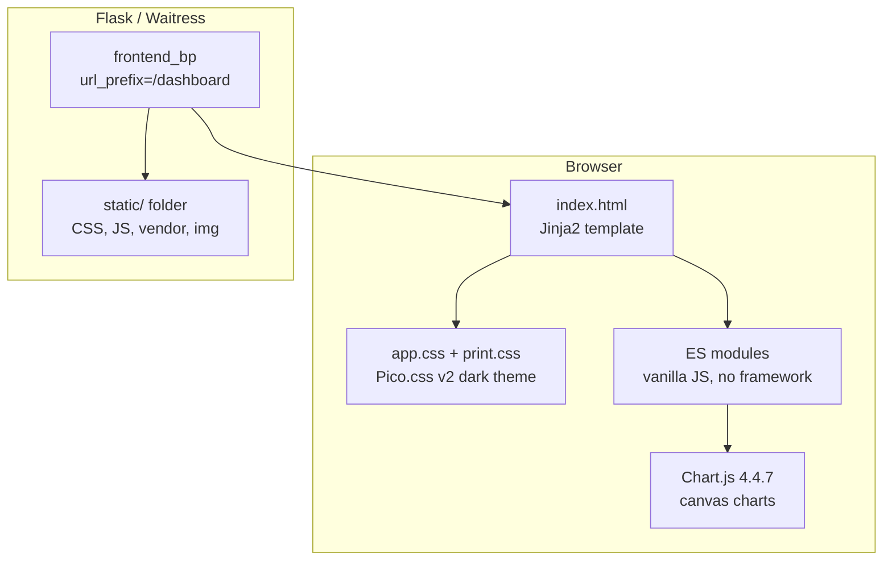
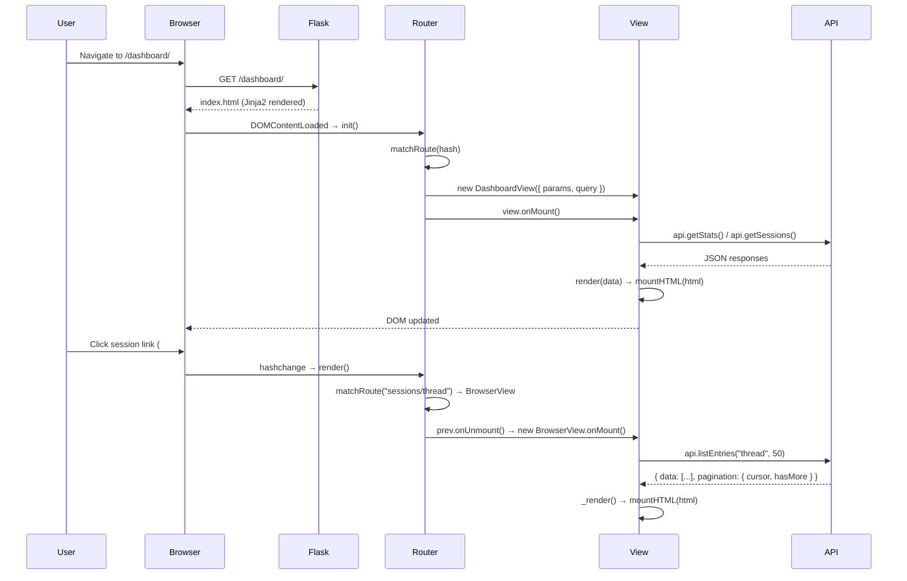
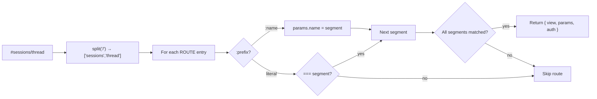
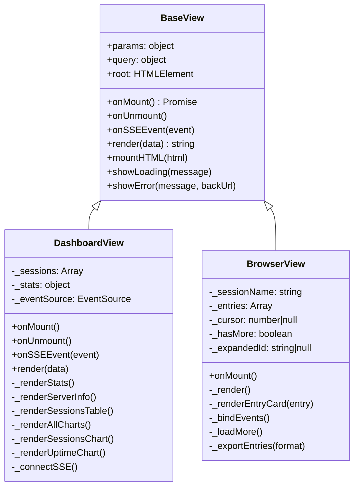
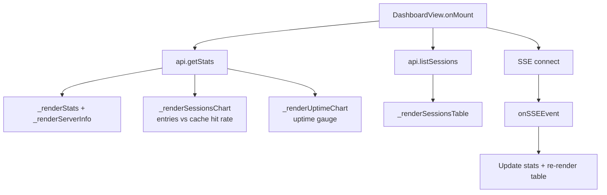
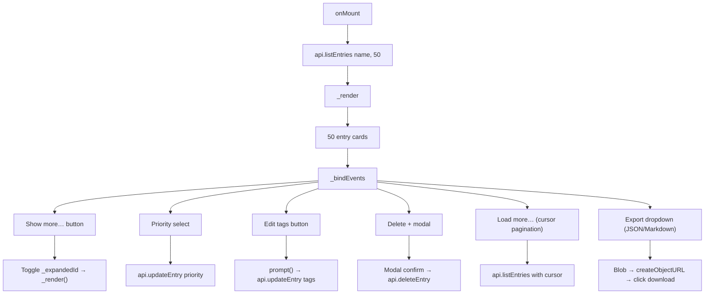
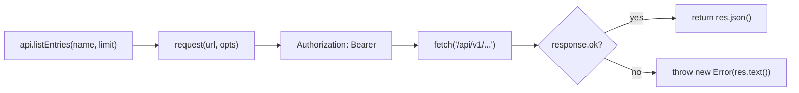
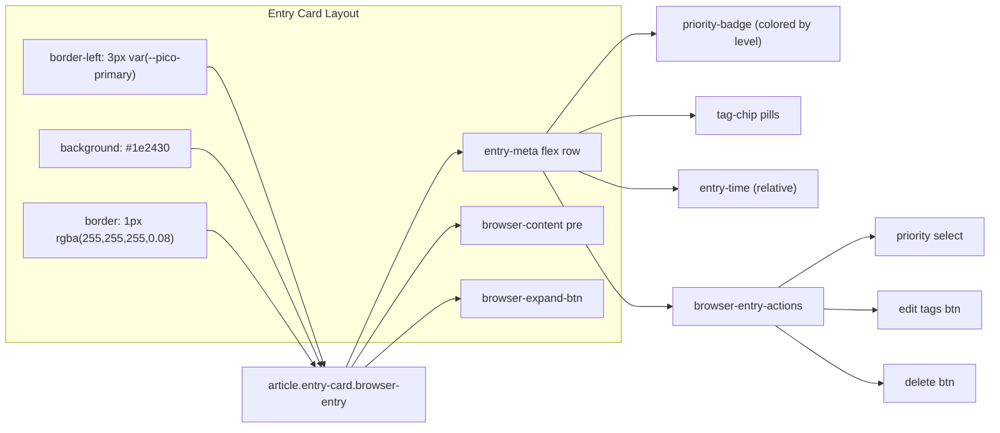
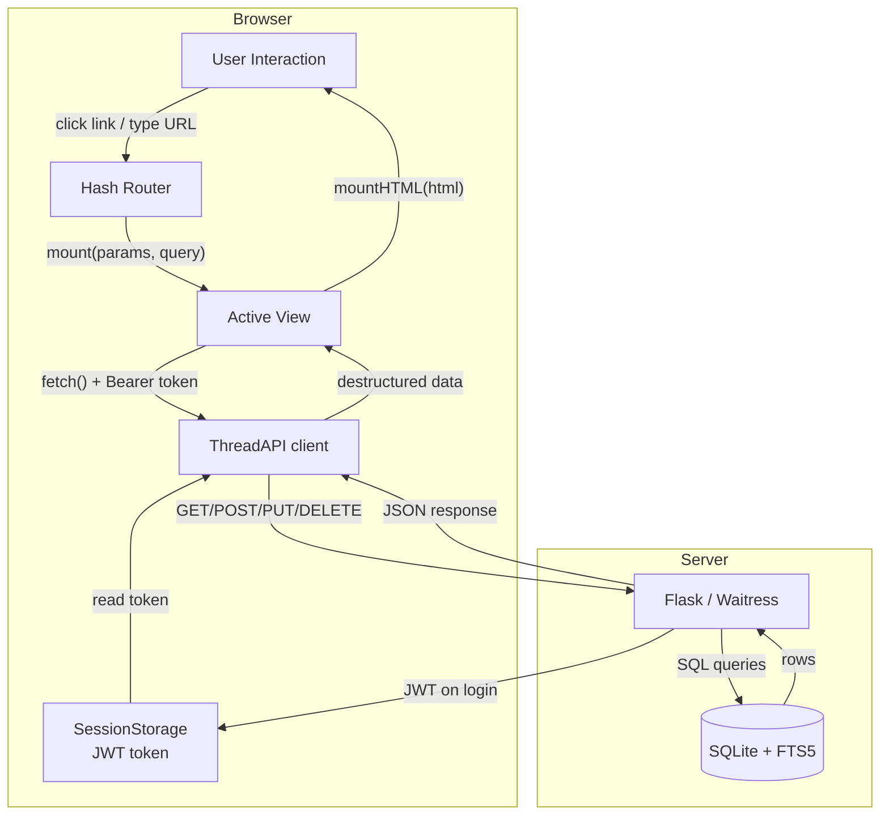

# Thread — Frontend Architecture

> Vanilla JS SPA served by Flask at `/dashboard/*`. Hash router, Pico.css dark theme, Chart.js analytics, zero build step.

## Overview

The Thread frontend is a **single-page application** (SPA) with no build pipeline — plain HTML, CSS, and ES modules served directly by Flask/Waitress. All client-side routing uses `window.location.hash`, so page refreshes work without server-side route matching.



## Directory Structure

```
thread_frontend/
├── __init__.py            # Flask Blueprint, serves index.html for all /dashboard/* routes
├── templates/
│   └── index.html         # Shell HTML — Jinja2 renders once, SPA takes over
└── static/
    ├── vendor/
    │   └── pico.min.css   # Pico.css v2 classless dark theme (~30KB)
    ├── css/
    │   ├── app.css        # Custom styles (layout, cards, browser, charts, modals)
    │   └── print.css      # Print-specific styles (hides nav, buttons, modals)
    ├── js/
    │   ├── app.js         # Entry point — bootstraps router + auth
    │   ├── router.js      # Hash router — matches #/path to View classes
    │   ├── api.js         # ThreadAPI class — fetch wrapper for all endpoints
    │   ├── auth.js        # Auth module — JWT token management, auto-login
    │   ├── utils.js       # escapeHtml(), showToast(), relativeTime(), priorityColor()
    │   └── views/
    │       ├── index.js   # Barrel file — exports all views
    │       ├── base.js    # BaseView — lifecycle (onMount, onUnmount, render)
    │       ├── login.js   # LoginView — API key → JWT form
    │       ├── dashboard.js  # DashboardView — stats, charts, sessions table
    │       └── sessions/
    │           ├── browser.js  # BrowserView — paginated entry list + CRUD
    │           ├── history.js  # HistoryView — git log + diff + revert
    │           └── graph.js    # GraphView — entry cross-reference table
    └── img/
        └── logo.svg       # Thread logo (optional)
```

## SPA Lifecycle



## Hash Router (`router.js`)

Simple pattern-matching router — no dependencies, ~70 lines.

### Route Table

| Hash Pattern | View Class | Auth | Description |
|-------------|-----------|------|-------------|
| `""` (empty) | `DashboardView` | No | Stats, charts, sessions table |
| `sessions/:name` | `BrowserView` | Yes | Paginated entry browser |
| `sessions/:name/history` | `HistoryView` | Yes | Git commit log + diffs |
| `sessions/:name/graph` | `GraphView` | Yes | Entry cross-references |
| `search` | `SearchView` | Yes | FTS5 search + tag filter |
| `upload` | `UploadView` | Yes | File upload + chunk progress |
| `settings` | `SettingsView` | Yes | Server config / info |
| `login` | `LoginView` | No | API key → JWT form |

### Route Matching



### Query String Parsing

Hash query strings (`#/search?q=hello&tags=system`) are parsed into a `query` object:
```js
// router.js → parseQuery()
// "#/search?q=hello&tags=system" → { q: "hello", tags: "system" }
```

Route params and query are passed to views as:
```js
new match.view({ params: match.params, query })
```

### Auth Guard

The router checks `Auth.isAuthenticated()` before mounting `auth: true` routes. If the server requires authentication (`isAuthRequired()`) and the user isn't authenticated, they're redirected to `#/login`. If auth is disabled server-side, the auto-login flow kicks in transparently.

## View Architecture

### BaseView (`base.js`)

All views extend `BaseView`, which provides the lifecycle contract:



### View Lifecycle

1. **Constructor** — stores `params` and `query` from the router
2. **`onMount()`** — fetches data, calls `render()`, binds events. Called by router after construction
3. **`render(data)`** — returns an HTML string. Most views call `mountHTML()` with the result
4. **`onUnmount()`** — cleans up listeners, EventSource, Chart.js instances. Called by router before navigating away

### DashboardView — Charts & SSE

The dashboard has two Chart.js charts, real-time SSE updates, and a sessions table.



**Charts:**
- **Sessions chart**: Two-line graph (Chart.js `line` type) — blue line for entries per session (left Y axis), green dashed line for cache hit rate % (right Y axis 0–100%)
- **Uptime chart**: Single stat display showing server uptime

**SSE (Server-Sent Events):** Dashboard connects to `/api/v1/events` with the JWT token. Every 30 seconds the server pushes updated stats, and the dashboard re-renders the sessions table + stat cards without a full page refresh.

### BrowserView — Entry List + CRUD

Paginated entry browser with cursor-based "Load more", inline editing, and export.

> **Type coercion note:** Entry IDs from the API are integers, but DOM `dataset` attributes are always strings. `_renderEntryCard()` normalizes with `const entryId = String(entry.id ?? "")` so `dataset.entryId` comparisons (e.g., "Show more" button, expand toggle) work reliably.



**Pagination:** Uses cursor-based pagination via `before` parameter (the last entry's `id`). "Load more" fetches the next 50 entries and appends them.

**Export:** Dropdown with two format options:
- **JSON** — array of entry objects (`{ id, content, priority, tags, created_at }`). Good for backup/restore.
- **Markdown** — human-readable document with headers, priority labels, tags, timestamps. Good for sharing.

### HistoryView — Git Log

Shows the git commit log for a session with paginated "Load more". Each commit shows the message, date, and a "View diff" button. Diffs open in a modal showing the full `git diff` output. Revert button restores a previous state.

### GraphView — Entry Cross-References

Scans all entries for cross-references (@mentions, #tags, URL links) and renders a link table showing which entries reference each other. Future: full vis-network force-directed graph.

### SearchView — FTS5 Search

Full-text search across sessions with FTS5 ranking, 300ms debounced input, and BM25 relevance scores.

**Search input:** Standalone `<input type="search">` (Pico pill). No attached button — no alignment issues with replaced vs non-replaced elements.

**Session filter:** `<details class="search-filter">` disclosure below the input. Summary shows `▸ Sessions: **All sessions**` (or `**N sessions**`) with a `▸`/`▾` arrow updated via the native `toggle` event. Open/close is browser-native — zero JS close-handler code, zero `z-index` or `position: absolute` hacks. Mutual exclusion preserved: picking any session deselects "All sessions", clicking "All" clears individual picks. Selection syncs to the URL hash (`?sessions=...`).

**Result cards:** Each result shows a session label badge, priority badge, tag chips, relative time, and a BM25 rank score. Content highlights wrap matching terms in `<em>` tags.

## API Client (`api.js`)

Thin wrapper around `fetch()` with JWT auth header injection:



All API methods return the full JSON response. Views are responsible for destructuring:

```js
// API response shape:
{ data: [...], pagination: { cursor: "123", hasMore: true } }

// Views destructure:
const { data, pagination } = await api.listEntries(name, 50);
```

**Auth token management** (`auth.js`):
- JWT stored in `sessionStorage`
- `Auth.isAuthenticated()` — checks token existence + expiry
- `Auth.isAuthRequired()` — checks server config, auto-logs in if auth is disabled
- Token added to all `fetch()` calls via `Authorization: Bearer` header
- On 401 response, token is cleared and user redirected to login

## CSS Architecture

### Theme: Pico.css v2 Classless Dark

Pico.css provides the dark theme foundation. The classless variant means semantic HTML (`<article>`, `<nav>`, `<table>`, `<button>`) gets styled automatically — no utility classes needed.

```
app.css layers:
 ├─ Layout (container max-width, #app-root min-height)
 ├─ Entry Cards (border-left accent, priority badges, tag chips)
 ├─ Dashboard Stats (metric cards grid, stat values)
 ├─ Browser (toolbar, export dropdown, entry actions, content collapse)
 ├─ Search (input + details disclosure filter, results)
 ├─ Upload (drop zone, progress bar, chunk info)
 ├─ Settings (config table)
 ├─ Toast (animated notifications — success/error/info)
 ├─ Modal (overlay + card, confirm/cancel actions)
 ├─ Charts (canvas containers, responsive sizing)
 └─ Print (print.css — hides nav, buttons, modals)
```

### Entry Card Styling



**Key CSS variables from Pico:**
- `--pico-primary` — accent color (blue `#01aaff`)
- `--pico-card-background-color` — `#181c25` (base card bg)
- `--pico-muted` — muted text/border (**Pico v2 classless caveat:** this variable is NOT defined. Use `rgba(255,255,255,0.08)` for borders and `rgba(255,255,255,0.3)` for muted text as safe fallbacks. Hardcoded fallback example: `.browser-entry { background: #1e2430; border: 1px solid rgba(255,255,255,0.08); }`)

### Print Styles (`print.css`)

Hides all interactive chrome when printing: navigation, buttons, modals, toast, the export dropdown, and browser actions. Only entry content, headers, and metadata are printed. Applied via `media="print"` on the `<link>` tag.

## Data Flow Summary



## Performance Characteristics

| Metric | Value | Notes |
|--------|-------|-------|
| **Initial load** | ~35KB HTML + ~30KB Pico.css + ~15KB JS | No build step, no bundler overhead |
| **Page transitions** | <50ms | Client-side hash routing, no server round-trip |
| **Chart rendering** | <100ms (Chart.js) | Canvas-based, 2 datasets per chart |
| **API calls** | 5-50ms (local network) | SQLite with WAL mode, no network latency on Pi |
| **SSE reconnect** | 30s interval | Server pushes stats; client reconnects automatically |
| **Memory (browser)** | ~5-10MB | Vanilla JS, no framework overhead |

## Browser Support

Target: **Modern evergreen browsers** (Chrome 90+, Firefox 90+, Safari 15+, Edge 90+).

Uses ES modules (`import`/`export`), `fetch()`, `AbortController`, `EventSource`, `Blob`, `URL.createObjectURL` — all widely supported since 2020. No polyfills needed.
