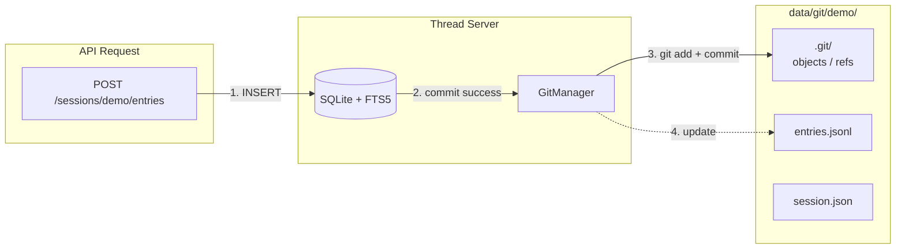
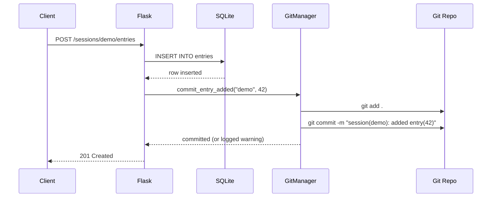

# Thread — Git Versioning

Every session gets its own Git repository. Every entry mutation gets committed automatically. The SQLite database is the source of truth — Git is your immutable audit trail and safety net.



## How It Works

### One Repo Per Session

Each session name maps to a directory under `THREAD_GIT_BASE` (default `data/git/`):

```
data/git/
├── thread/            ← git repo for session "thread"
│   ├── .git/
│   ├── session.json
│   └── entries.jsonl
├── demo/              ← git repo for session "demo"
│   ├── .git/
│   ├── session.json
│   └── entries.jsonl
└── my-project/        ← git repo for session "my-project"
    └── ...
```

### Lazy Initialization

Repos are NOT created when a session is created — they're created on the **first mutation**. The first time you add an entry to a session, `GitManager.ensure_repo()` runs `git init` and configures identity:

```bash
git init
git config user.email "thread@localhost"
git config user.name "Thread Server"
```

### Auto-Commit On Every Mutation

Every CRUD operation triggers a commit **after** the database transaction succeeds:



### Commit Messages

Every commit follows a standard format — machine-parseable and human-readable:

| Operation | Commit Message |
|-----------|---------------|
| Session created | `session(demo): created` |
| Session deleted | `session(demo): deleted` |
| Entry added | `session(demo): added entry(42)` |
| Entry updated | `session(demo): updated entry(17)` |
| Entry deleted | `session(demo): deleted entry(3)` |

### Best-Effort, Not Transactional

**The SQLite database is the source of truth.** Git is an audit trail.

If a Git commit fails (disk full, Git not installed, permissions error, concurrent lock timeout):

- The failure is **logged as a warning**
- The API response is **never blocked**
- The database mutation already succeeded and your data is safe

This means Git history might occasionally have gaps — but your data is never at risk.

### Thread Safety

Each repo gets its own `threading.Lock`. Two threads committing to **different** sessions run in parallel. Two threads committing to the **same** session serialize. Lock timeouts are 10 seconds — if Git hangs, the lock is released and the failure is logged.

## Browsing History

Git repos are standard — any Git tool works:

```bash
# View commit log
cd data/git/demo
git log --oneline
# a1b2c3d session(demo): added entry(15)
# e4f5g6h session(demo): updated entry(12)
# i7j8k9l session(demo): added entry(12)
# m0n1o2p session(demo): session created

# See what changed for a specific entry
git log -p --grep="entry(12)"

# Restore a deleted entry's data
git log --diff-filter=D --summary | grep entries.jsonl
git checkout abc1234 -- entries.jsonl

# Diff between two points in time
git diff HEAD~5..HEAD -- entries.jsonl
```

## What's Tracked

| File | Contents | Written By |
|------|----------|------------|
| `session.json` | `{"name": "demo"}` — session metadata | `GitManager.commit_session_created()` |
| `entries.jsonl` | One JSON object per line — the entries themselves | Application layer (before Git commit) |

The `_commit()` method runs `git add .` — anything in the repo directory gets committed.

## No Remotes

These are purely local repos. There is no `origin`, no push/pull, no GitHub integration. They exist solely as a local audit trail and rollback mechanism. If you want backups, back up the `data/` directory:

```bash
# Backup everything (database + git repos)
tar czf thread-backup-$(date +%Y%m%d).tar.gz data/

# Or just git repos
tar czf thread-git-backup-$(date +%Y%m%d).tar.gz data/git/
```

## Configuration

| Variable | Default (bare-metal) | Default (Docker) | Description |
|----------|---------------------|-------------------|-------------|
| `THREAD_GIT_BASE` | `data/git/` | `/app/data/git` | Root directory for per-session repos |

## Troubleshooting

### Git repos taking too much space

```bash
# Check per-session repo sizes
du -sh data/git/*/

# Clean up old sessions you no longer need
rm -rf data/git/old-session-name/
```

### Git not installed

If `git` is not on the system PATH, repos won't initialize and commits will silently fail (logged as warnings). The server still works — you just won't have version history. Install Git to enable this feature:

```bash
# Debian / Raspberry Pi OS
sudo apt install git
```

### Corrupted repo

If a repo gets corrupted (extremely rare), just delete it. The database is the source of truth:

```bash
rm -rf data/git/problem-session/
# Next mutation will re-initialize from current DB state
```
