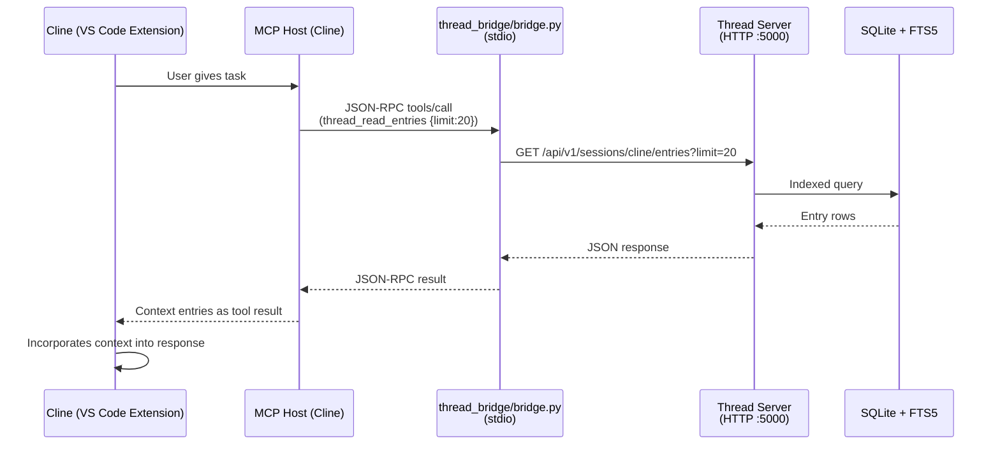

# Thread MCP Server — Cline Setup

> Add Thread as an MCP server in Cline to give Cline persistent context memory, full-text search, and session-scoped versioning across coding sessions.

## Overview

Thread's MCP bridge (`thread_bridge/bridge.py`) speaks the Model Context Protocol over stdio. Cline can launch it as a subprocess and route tool calls through it. Once connected, Cline gains 12 tools for creating, reading, searching, updating, and bulk-importing context entries — turning Thread into Cline's long-term memory and project knowledge base.



## Prerequisites

- **Thread server running** — either on `localhost:5000` or on a Raspberry Pi on your LAN
- **Python 3.11+** — same Python that runs the Thread bridge
- **Cline v3.0+** installed in VS Code
- The Thread repo cloned somewhere accessible (or at least `thread_bridge/`)

If you haven't started the Thread server yet, see [`DEPLOYMENT.md`](./DEPLOYMENT.md).

## Step 1: Find Your Paths

Get absolute paths for Python and the bridge script:

```bash
# Python (system or venv)
which python3
# Example: /usr/bin/python3

# Or venv:
echo "$(cd /home/brajam/repos/thread && pwd)/.venv/bin/python"

# Bridge directory (the repo root — needed for cwd)
echo "$(cd /home/brajam/repos/thread && pwd)"
# Example: /home/brajam/repos/thread
```

## Step 2: Open Cline MCP Settings

In VS Code with Cline installed:

1. Open the Cline sidebar (click the Cline icon in the activity bar, or `Ctrl+Shift+C` if configured)
2. Click the **gear icon** (⚙️) to open Cline settings
3. Scroll down to the **MCP Servers** section
4. Click **Edit MCP Settings** (or **Configure MCP Servers**)

This opens Cline's MCP configuration file. The exact location depends on your setup:

| Platform | Config File Path |
|----------|-----------------|
| VS Code (User) | `~/.cline/mcp_settings.json` |
| VS Code (Workspace) | `.cline/mcp_settings.json` in your project root |
| Cline CLI | `~/.cline/mcp_settings.json` |

## Step 3: Add the Thread Server Config

Add a `thread` entry to the `mcpServers` object. If the file is empty or doesn't have `mcpServers` yet, create it:

```json
{
  "mcpServers": {
    "thread": {
      "command": "/home/brajam/repos/thread/.venv/bin/python",
      "args": [
        "-m",
        "thread_bridge.bridge"
      ],
      "cwd": "/home/brajam/repos/thread",
      "env": {
        "THREAD_SERVER_URL": "http://localhost:5000",
        "THREAD_DEFAULT_SESSION": "cline",
        "THREAD_REQUEST_TIMEOUT": "10"
      },
      "disabled": false,
      "alwaysAllow": []
    }
  }
}
```

### Configuration Reference

| Field | Required | Description |
|-------|----------|-------------|
| `command` | Yes | Absolute path to `python3` |
| `args` | Yes | `["-m", "thread_bridge.bridge"]` — runs bridge as a Python module |
| `cwd` | Yes | The Thread repo root — needed so `thread_bridge` is importable |
| `env.THREAD_SERVER_URL` | Yes | `http://<host>:5000` — where Thread server is running |
| `env.THREAD_DEFAULT_SESSION` | No | Default session name (default: `"default"`). Use `"cline"` to auto-scope Cline's context. |
| `env.THREAD_REQUEST_TIMEOUT` | No | HTTP timeout in seconds (default: `10`) |
| `disabled` | No | Set to `true` to temporarily disable without removing config |
| `alwaysAllow` | No | List of tool names to auto-approve (e.g., `["thread_search", "thread_read_entries"]`) |

### Using a Remote Pi Server

If Thread runs on a Raspberry Pi at `192.168.1.100`:

```json
"env": {
  "THREAD_SERVER_URL": "http://192.168.1.100:5000",
  "THREAD_DEFAULT_SESSION": "cline"
}
```

## Step 4: Auto-Approve Read-Only Tools (Recommended)

Cline asks for permission before running each tool. To reduce friction for harmless read operations, add safe tools to `alwaysAllow`:

```json
{
  "mcpServers": {
    "thread": {
      "command": "/home/brajam/repos/thread/.venv/bin/python",
      "args": ["-m", "thread_bridge.bridge"],
      "cwd": "/home/brajam/repos/thread",
      "env": {
        "THREAD_SERVER_URL": "http://localhost:5000",
        "THREAD_DEFAULT_SESSION": "cline"
      },
      "disabled": false,
      "alwaysAllow": [
        "thread_search",
        "thread_read_entries",
        "thread_read_entries_batch",
        "thread_list_sessions",
        "thread_get_tags",
        "thread_get_stats"
      ]
    }
  }
}
```

Write tools (`thread_create_entry`, `thread_create_session`, `thread_update_entry`, `thread_delete_entry`, `thread_bulk_create_entries`, `thread_upload_file`) are **not** in `alwaysAllow` — you'll be prompted before Cline modifies your context database.

## Step 5: Verify the Connection

1. **Reload VS Code** (`Ctrl+Shift+P` → **Developer: Reload Window**)
2. Open the Cline sidebar
3. Look for the Thread server in the **MCP Servers** list — it should show a green dot and "12 tools"
4. In the Cline chat, type: *"What Thread sessions exist?"*
   - Cline should invoke `thread_list_sessions` and show the result
5. If it's a fresh server, you'll see an empty array or just the `"cline"` session (auto-created on first use)

### Troubleshooting

**Server shows red dot / "disconnected"**
- Check the Cline output logs: click the server name, then **View Logs**
- Common issues: wrong `command` path, missing `cwd`, Python can't find `thread_bridge`
- Test manually: `cd /home/brajam/repos/thread && .venv/bin/python -m thread_bridge.bridge` — should sit waiting on stdin

**Tools appear but fail with errors**
- Verify Thread server is running: `curl http://localhost:5000/api/v1/health`
- Check `THREAD_SERVER_URL` in env — must be the full URL including port

**Cline says "0 tools"**
- The bridge may have started but the `tools/list` response failed
- Check the bridge logs in Cline's MCP server log viewer
- Run a quick test: `echo '{"jsonrpc":"2.0","id":1,"method":"tools/list","params":{}}' | .venv/bin/python -m thread_bridge.bridge`

## Available Tools (12 total)

Once connected, these tools are available to Cline. **Sessions are auto-created** when you create your first entry — no explicit session setup needed.

| Tool | Write? | Description |
|------|--------|-------------|
| `thread_create_entry` | ✏️ | Create a context entry (content, priority, tags) — auto-creates session |
| `thread_read_entries` | 📖 | Read entries with cursor pagination |
| `thread_read_entries_batch` | 📖 | Fetch multiple entries by ID in one round-trip |
| `thread_update_entry` | ✏️ | Update an existing entry |
| `thread_delete_entry` | ✏️ | Delete an entry |
| `thread_search` | 📖 | Full-text search across entries (FTS5 with BM25 ranking) |
| `thread_create_session` | ✏️ | Explicitly create a new session (name, description) |
| `thread_list_sessions` | 📖 | List all sessions |
| `thread_get_tags` | 📖 | Get all tags used in a session |
| `thread_get_stats` | 📖 | Server performance metrics (uptime, cache stats, latency) |
| `thread_bulk_create_entries` | ✏️ | Create up to 100 entries in one call |
| `thread_upload_file` | ✏️ | Upload & chunk a local file into entries |

📖 = safe to auto-approve | ✏️ = requires confirmation

## Usage Patterns

### 1. Project Onboarding — Feed Cline Your Codebase

Before starting work in a new project, load relevant documentation into Thread, then let Cline read it:

> *"Read the last 30 entries from the **architecture** session and summarize the key patterns I should follow in this codebase."*

### 2. Long-Running Task Memory

When a task spans many Cline messages and you need to remember decisions:

> *"Save this decision to Thread: authentication uses JWT with 15-minute expiry, stored in httpOnly cookies. Session: **auth-design**, priority: 9, tags: auth, jwt, security"*

Later: *"What did we decide about JWT expiry? Check Thread."*

### 3. Cross-Session Context

Before starting a new Cline session, load context from the last one:

> *"Search Thread for everything in the **refactor** session from the past week, then read the top 10 most relevant entries."*

### 4. Bulk Import Documentation

> *"Upload the file `docs/ARCHITECTURE.md` to Thread session **project-docs** with priority 8 and tags: architecture, reference"*

Cline will invoke `thread_upload_file`, which reads the local file, chunks it by headings, and creates entries for each section.

### 5. Search Before Coding

> *"Search Thread for 'database connection' before you write the pool module — I want to see if we've already discussed pooling strategies."*

## Advanced: Session Management

### Creating Sessions

Cline can manage sessions via the sessions API. Use `thread_create_session` to explicitly create named sessions, or let them auto-create on first entry write. Two approaches:

**Approach A: Let Cline create the first entry in a new session**
> *"Add this note to a session called **new-feature**: 'Starting implementation of the caching layer. Requirements: TTL-based, max 512 entries, write-through invalidation.'"*

The session `new-feature` will be auto-created when the first entry is written.

**Approach B: Use curl directly (one-time setup)**

```bash
curl -X POST http://localhost:5000/api/v1/sessions \
  -H "Content-Type: application/json" \
  -d '{"name": "backend-v2", "description": "Backend v2 rewrite context"}'
```

Then tell Cline: *"Use the **backend-v2** session."*

### Listing All Sessions

> *"What Thread sessions do I have?"*

Cline calls `thread_list_sessions` and shows all session names, descriptions, and entry counts.

## Automatic Context

The bridge auto-creates your default session when Cline connects — you'll see it in `thread_list_sessions` immediately. No manual setup needed.

For **automatic context saving**, copy the skill to your project:

1. Copy [`.github/skills/thread-auto-context/`](../.github/skills/thread-auto-context/) to your project's `.github/skills/`
2. Add (or update) [`.github/copilot-instructions.md`](../.github/copilot-instructions.md) — a minimal stub that tells the agent to load the skill

This tells Cline-compatible agents to:

- Search Thread for relevant context at the start of every session
- Save important decisions, preferences, and constraints automatically
- Save a session summary at the end

## Limitations

- **Auto-init requires server** — The bridge creates the default session on connect, but if the Thread server is unreachable, it silently skips warmup.
- **Single-user** — Thread is designed as a personal context server. No access control between sessions.
- **Same-machine or LAN only** — Cline and Thread server must be on the same network.
- **Python dependency** — The bridge requires Python 3.11+ on the workstation running Cline.
- **No binary/file storage** — Entries are text only. For binary artifacts, store references (file paths, URLs) as entry content.
