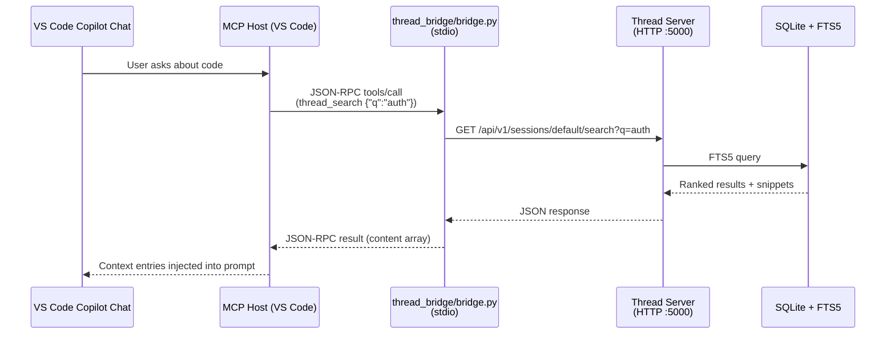

# Thread MCP Server — VS Code Copilot Setup

> Add Thread as an MCP server in VS Code Copilot to give Copilot Chat persistent context memory, full-text search, and session-scoped versioning across conversations.

## Overview

Thread's MCP bridge (`thread_bridge/bridge.py`) speaks the Model Context Protocol over stdio. VS Code Copilot (1.99+) can launch it as a subprocess and route Copilot Chat tool calls through it. Once connected, Copilot gains 12 tools for creating, reading, searching, updating, and bulk-importing context entries.



## Prerequisites

- **Thread server running** — either on the same machine (`localhost:5000`) or on a Raspberry Pi on your LAN
- **Python 3.11+** — system Python is fine, the skill auto-creates a venv at `~/.thread-bridge/`
- **VS Code 1.99+** with GitHub Copilot Chat extension installed
- The bridge is auto-downloaded to `~/.thread-bridge/` by the auto-context skill

## Step 1: Auto-Bootstrap (Recommended)

The [`thread-auto-context` skill](../.github/skills/thread-auto-context/SKILL.md) handles everything automatically:

1. Downloads the bridge to `~/.thread-bridge/` (global, shared across workspaces)
2. Creates a venv at `~/.thread-bridge/.venv/` and installs `requests`
3. Writes the global MCP config at `~/.vscode-server/data/User/globalStorage/github.copilot-chat/mcp.json`
4. VS Code picks up the config on next reload — Thread tools appear automatically

**No manual steps needed.** If you prefer manual setup, continue below.

## Manual Setup

### Step 1: Set Up the Bridge

```bash
mkdir -p ~/.thread-bridge/thread_bridge/
cd ~/.thread-bridge
python3 -m venv .venv
.venv/bin/pip install requests>=2.31
# Download bridge files from GitHub:
curl -sSfL -o thread_bridge/__init__.py https://raw.githubusercontent.com/jtmb/thread/main/thread_bridge/__init__.py
curl -sSfL -o thread_bridge/bridge.py https://raw.githubusercontent.com/jtmb/thread/main/thread_bridge/bridge.py
curl -sSfL -o thread_bridge/client.py https://raw.githubusercontent.com/jtmb/thread/main/thread_bridge/client.py
curl -sSfL -o thread_bridge/config.py https://raw.githubusercontent.com/jtmb/thread/main/thread_bridge/config.py
```

### Step 2: Write Global MCP Config

Create `~/.vscode-server/data/User/globalStorage/github.copilot-chat/mcp.json` (replace `/home/brajam` with your home directory):
{
  "servers": {
    "thread": {
      "type": "stdio",
      "command": "/home/brajam/.thread-bridge/.venv/bin/python",
      "args": ["-m", "thread_bridge.bridge"],
      "cwd": "/home/brajam/.thread-bridge",
      "env": {
        "THREAD_SERVER_URL": "http://localhost:5000",
        "THREAD_DEFAULT_SESSION": "default",
        "THREAD_REQUEST_TIMEOUT": "10"
      }
    }
  },
  "inputs": []
}
```

### Configuration Reference

| Field | Required | Description |
|-------|----------|-------------|
| `command` | Yes | Absolute path to Python in the bridge venv (`~/.thread-bridge/.venv/bin/python`) |
| `args` | Yes | `["-m", "thread_bridge.bridge"]` — run as a module |
| `cwd` | Yes | `~/.thread-bridge` — the bridge install directory |
| `env.THREAD_SERVER_URL` | Yes | `http://<host>:5000` — where the Thread server is running |
| `env.THREAD_DEFAULT_SESSION` | No | Fallback session name (default: `"default"`). For per-project isolation, pass `session` explicitly on each tool call using the workspace basename. |
| `env.THREAD_REQUEST_TIMEOUT` | No | HTTP timeout in seconds (default: `10`) |
| `env.THREAD_API_TOKEN` | No | Pre-generated API token (from Settings dashboard). Preferred over `THREAD_AUTH_PASSWORD`. Tokens never expire. |

### Using a Remote Pi Server

If Thread is running on a Raspberry Pi at `192.168.1.100`:

```json
"env": {
  "THREAD_SERVER_URL": "http://192.168.1.100:5000",
  "THREAD_DEFAULT_SESSION": "default"
}
```

## Step 3: Verify the Connection

1. **Reload VS Code** (`Ctrl+Shift+P` → **Developer: Reload Window**)
2. Open Copilot Chat (`Ctrl+Shift+I`)
3. Ask: *"List my Thread sessions"*
   - Copilot should invoke the `thread_list_sessions` tool
   - The bridge auto-creates your default session on connect, so you'll see it immediately (not `[]`)
4. Ask: *"Create a Thread session called test-session"*
   - Copilot should invoke `thread_create_session`
   - Verify: *"What Thread sessions exist?"* should now show both sessions

### Troubleshooting

**"MCP server 'thread' failed to start"**
- Check the Python path exists: `ls ~/.thread-bridge/.venv/bin/python`
- Check the bridge imports correctly: `cd ~/.thread-bridge && .venv/bin/python -c "from thread_bridge.bridge import main"`

**Tools appear but return errors**
- Verify the Thread server is running: `curl http://localhost:5000/api/v1/health`
- Check the server URL in `THREAD_SERVER_URL` matches

**No tools appear in Copilot**
- Ensure VS Code is 1.99+
- Check the **Output** panel → select **GitHub Copilot Chat** from the dropdown — look for MCP connection logs

## Available Tools (12 total)

Once connected, Copilot can use these tools automatically. **Sessions are auto-created** when you create your first entry — no explicit session setup needed.

| Tool | Description |
|------|-------------|
| `thread_create_entry` | Create a context entry (content, priority, tags) — auto-creates session |
| `thread_read_entries` | Read entries with cursor pagination |
| `thread_read_entries_batch` | Fetch multiple entries by ID in one call |
| `thread_update_entry` | Update an existing entry |
| `thread_delete_entry` | Delete an entry |
| `thread_search` | Full-text search across entries (FTS5) |
| `thread_create_session` | Explicitly create a new session (name, description) |
| `thread_list_sessions` | List all sessions |
| `thread_get_tags` | Get all tags in a session |
| `thread_get_stats` | Get server performance metrics |
| `thread_bulk_create_entries` | Create up to 100 entries at once |
| `thread_upload_file` | Upload & chunk a local file into entries |

## Usage Tips

### Tell Copilot Which Session to Use

Copilot defaults to `THREAD_DEFAULT_SESSION` from the global MCP config. For per-project isolation, Copilot passes `session` with the workspace basename on each call.

> *"Search for 'authentication' in the **backend-design** session"*

Copilot will pass `session: "backend-design"` to `thread_search`.

### Feed Context Before a Task

Before asking Copilot to work on a feature, load relevant context:

> *"Read the last 20 entries from the **architecture** session and summarize the key design decisions"*

### Persist Decisions During a Task

After Copilot makes a design decision or you discuss something important:

> *"Save this to Thread: we decided to use SQLite WAL mode with 100MB page cache, priority 8, tags: database, performance"*

### Search Before Starting

> *"Search Thread for anything about 'rate limiting' before you write the middleware"*

## Automatic Context

The `thread-auto-context` skill (`alwaysApply: true`) makes context saving automatic — no setup files required. When Copilot connects to a workspace with the skill, it:

1. **Bootstraps the bridge** — downloads the 5 bridge files from `jtmb/thread` main on GitHub, creates a self-contained venv at `~/.thread-bridge/`, installs `requests`, and writes the global MCP config at `~/.vscode-server/data/User/globalStorage/github.copilot-chat/mcp.json` — zero manual steps
2. **Searches Thread automatically** with every user question to surface relevant past context
3. **Saves decisions, preferences, and constraints** during the session
4. **Saves a summary** at session end

To enable this in any project, **just copy the skill directory**:

```bash
# From the Thread repo:
cp -r .github/skills/thread-auto-context/ /path/to/your-project/.github/skills/
```

The skill's frontmatter (`alwaysApply: true`) tells Copilot to load it automatically — no `.github/copilot-instructions.md` stub needed.

**Without this skill**, Copilot only uses Thread when you explicitly ask.

## Limitations

- **Auto-init requires server** — The bridge creates the default session on connect, but if the Thread server is unreachable, it silently skips warmup.
- **No multi-user isolation** — Thread is a single-user server. All sessions/entries are visible to all MCP clients.
- **Network dependency** — If the Thread server is on a Pi, Copilot needs LAN access to it.
