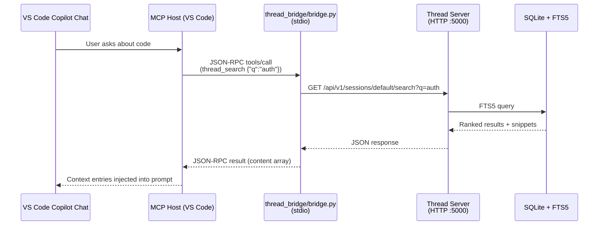

# Thread MCP Server — VS Code Copilot Setup

> Add Thread as an MCP server in VS Code Copilot to give Copilot Chat persistent context memory, full-text search, and session-scoped versioning across conversations.

## Overview

Thread's MCP bridge (`thread_bridge/bridge.py`) speaks the Model Context Protocol over stdio. VS Code Copilot (1.99+) can launch it as a subprocess and route Copilot Chat tool calls through it. Once connected, Copilot gains 12 tools for creating, reading, searching, updating, and bulk-importing context entries.



## Prerequisites

- **Thread server running** — either on the same machine (`localhost:5000`) or on a Raspberry Pi on your LAN
- **Python 3.11+** — same Python that runs the Thread bridge
- **VS Code 1.99+** with GitHub Copilot Chat extension installed
- The Thread repo cloned (or at least `thread_bridge/` available)

If you haven't started the Thread server yet, see [`DEPLOYMENT.md`](./DEPLOYMENT.md).

## Step 1: Find Your Python Path

The bridge needs an absolute path to Python. Run:

```bash
which python3
# Example: /usr/bin/python3

# Or if using a venv:
cd /home/brajam/repos/thread && echo "$PWD/.venv/bin/python"
# Example: /home/brajam/repos/thread/.venv/bin/python
```

Note the full path — you'll use it in the MCP config.

## Step 2: Find the Bridge Script Path

Get the absolute path to the bridge entry point:

```bash
cd /home/brajam/repos/thread && echo "$PWD/thread_bridge/bridge.py"
# Example: /home/brajam/repos/thread/thread_bridge/bridge.py
```

## Step 3: Add MCP Server Config

> **💡 Auto-setup**: If you've copied the [`thread-auto-context` skill](../.github/skills/thread-auto-context/SKILL.md) to your project, the agent will auto-create `.vscode/mcp.json` on first connect — skip to Step 4.

Create `.vscode/mcp.json` in your project root (copy from [`.vscode/mcp.example.json`](../.vscode/mcp.example.json) if available):
```json
{
  "servers": {
    "thread": {
      "type": "stdio",
      "command": "/home/brajam/repos/thread/.venv/bin/python",
      "args": ["-m", "thread_bridge.bridge"],
      "cwd": "/home/brajam/repos/thread",
      "env": {
        "THREAD_SERVER_URL": "http://localhost:5000",
        "THREAD_DEFAULT_SESSION": "copilot",
        "THREAD_REQUEST_TIMEOUT": "10"
      }
    }
  },
  "inputs": []
}
```

### Configuration Reference

| Field | Required | Description |
|-------|----------|-------------|
| `command` | Yes | Absolute path to `python3` (system or venv) |
| `args` | Yes | `["-m", "thread_bridge.bridge"]` — run as a module |
| `cwd` | Yes | The Thread repo root (so Python finds `thread_bridge/`) |
| `env.THREAD_SERVER_URL` | Yes | `http://<host>:5000` — where the Thread server is running |
| `env.THREAD_DEFAULT_SESSION` | No | Session name to use when not specified in tool calls (default: `"default"`) |
| `env.THREAD_REQUEST_TIMEOUT` | No | HTTP timeout in seconds (default: `10`) |

### Using a Remote Pi Server

If Thread is running on a Raspberry Pi at `192.168.1.100`:

```json
"env": {
  "THREAD_SERVER_URL": "http://192.168.1.100:5000",
  "THREAD_DEFAULT_SESSION": "copilot"
}
```

## Step 4: Verify the Connection

1. **Reload VS Code** (`Ctrl+Shift+P` → **Developer: Reload Window**)
2. Open Copilot Chat (`Ctrl+Shift+I`)
3. Ask: *"List my Thread sessions"*
   - Copilot should invoke the `thread_list_sessions` tool
   - The bridge auto-creates your default session on connect, so you'll see it immediately (not `[]`)
4. Ask: *"Create a Thread session called test-session"*
   - Copilot should invoke `thread_create_session`
   - Verify: *"What Thread sessions exist?"* should now show both sessions

### Troubleshooting

**"MCP server 'thread' failed to start"**
- Check the Python path exists: `ls /home/brajam/repos/thread/.venv/bin/python`
- Check the bridge imports correctly: `cd /home/brajam/repos/thread && .venv/bin/python -c "from thread_bridge.bridge import main"`

**Tools appear but return errors**
- Verify the Thread server is running: `curl http://localhost:5000/api/v1/health`
- Check the server URL in `THREAD_SERVER_URL` matches

**No tools appear in Copilot**
- Ensure VS Code is 1.99+
- Check the **Output** panel → select **GitHub Copilot Chat** from the dropdown — look for MCP connection logs

## Available Tools (12 total)

Once connected, Copilot can use these tools automatically. **Sessions are auto-created** when you create your first entry — no explicit session setup needed.

| Tool | Description |
|------|-------------|
| `thread_create_entry` | Create a context entry (content, priority, tags) — auto-creates session |
| `thread_read_entries` | Read entries with cursor pagination |
| `thread_read_entries_batch` | Fetch multiple entries by ID in one call |
| `thread_update_entry` | Update an existing entry |
| `thread_delete_entry` | Delete an entry |
| `thread_search` | Full-text search across entries (FTS5) |
| `thread_create_session` | Explicitly create a new session (name, description) |
| `thread_list_sessions` | List all sessions |
| `thread_get_tags` | Get all tags in a session |
| `thread_get_stats` | Get server performance metrics |
| `thread_bulk_create_entries` | Create up to 100 entries at once |
| `thread_upload_file` | Upload & chunk a local file into entries |

## Usage Tips

### Tell Copilot Which Session to Use

Copilot defaults to the session from `THREAD_DEFAULT_SESSION`. To use a different one, just mention it:

> *"Search for 'authentication' in the **backend-design** session"*

Copilot will pass `session: "backend-design"` to `thread_search`.

### Feed Context Before a Task

Before asking Copilot to work on a feature, load relevant context:

> *"Read the last 20 entries from the **architecture** session and summarize the key design decisions"*

### Persist Decisions During a Task

After Copilot makes a design decision or you discuss something important:

> *"Save this to Thread: we decided to use SQLite WAL mode with 100MB page cache, priority 8, tags: database, performance"*

### Search Before Starting

> *"Search Thread for anything about 'rate limiting' before you write the middleware"*

## Automatic Context

The bridge auto-creates your default session when VS Code connects — you'll see it in `thread_list_sessions` immediately. No manual setup needed.

For **automatic context saving**, copy the skill to your project:

1. Copy [`.github/skills/thread-auto-context/`](../.github/skills/thread-auto-context/) to your project's `.github/skills/`
2. Add (or update) [`.github/copilot-instructions.md`](../.github/copilot-instructions.md) — a minimal stub that tells Copilot to load the skill

This tells Copilot to:

- Search Thread for relevant context at the start of every session
- Save important decisions, preferences, and constraints automatically
- Save a session summary at the end

**Without these files**, Copilot only uses Thread when you explicitly ask. **With them**, context saving becomes automatic.

## Limitations

- **Auto-init requires server** — The bridge creates the default session on connect, but if the Thread server is unreachable, it silently skips warmup.
- **No multi-user isolation** — Thread is a single-user server. All sessions/entries are visible to all MCP clients.
- **Network dependency** — If the Thread server is on a Pi, Copilot needs LAN access to it.
