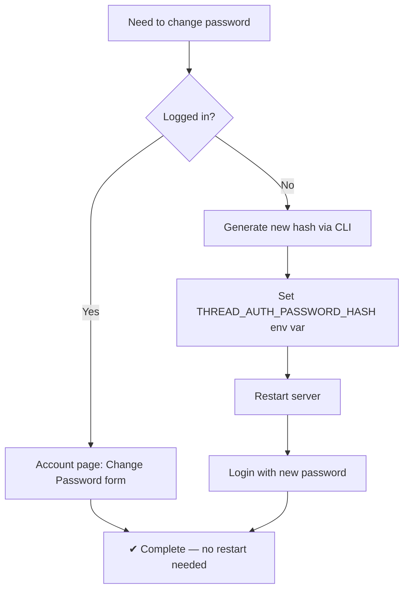

# Reset Password

How to generate or change the Thread admin password.

## In-App Password Change (Preferred)

Once logged into the Thread dashboard, go to **Account** (`#/settings`) and use the
**Change Password** form. Enter your current password, a new password (min 8 chars),
and confirm. The new hash is persisted to `data/.password_hash` and survives server
restarts.

This is the recommended way to change the password — no CLI or env var editing needed.

## API Endpoint

`POST /api/v1/auth/change-password` — requires a valid Bearer token.

```bash
curl -X POST http://localhost:5000/api/v1/auth/change-password \
  -H "Authorization: Bearer <token>" \
  -H "Content-Type: application/json" \
  -d '{"current_password":"old","new_password":"newpass123"}'
```

Responses:
- `200`: `{"status":"ok","message":"Password changed"}`
- `400`: Bad request (missing fields, password < 8 chars, auth disabled)
- `401`: Current password incorrect

The new hash is written to `THREAD_AUTH_PASSWORD_HASH_FILE` (default `data/.password_hash`).
This file takes priority over the `THREAD_AUTH_PASSWORD_HASH` env var at login time.

## CLI Generation (Initial Setup)

```bash
cd /home/brajam/repos/thread
source .venv/bin/activate
python -m thread_server.cli.set_password
```

The tool prompts for a password (hidden), confirms it, and prints the two env vars you need:

```
THREAD_AUTH_SECRET_KEY=...
THREAD_AUTH_PASSWORD_HASH=...
```

Restart the server with those values:

```bash
THREAD_AUTH_ENABLED=true \
THREAD_AUTH_SECRET_KEY=<from above> \
THREAD_AUTH_PASSWORD_HASH=<from above> \
python -m thread_server.server
```

## Programmatic Generation

If you need to script it (no interactive prompt):

```python
from thread_server.auth import hash_password, generate_secret_key

password = "your-password-here"
pw_hash = hash_password(password)
secret = generate_secret_key()

print(f"THREAD_AUTH_SECRET_KEY={secret}")
print(f"THREAD_AUTH_PASSWORD_HASH={pw_hash}")
```

Or in one line from bash:

```bash
python3 -c "
from thread_server.auth import hash_password, generate_secret_key
h = hash_password('mypassword')
s = generate_secret_key()
print(f'THREAD_AUTH_SECRET_KEY={s}')
print(f'THREAD_AUTH_PASSWORD_HASH={h}')
"
```

## Password Requirements

| Constraint | Value |
|------------|-------|
| Minimum length | 4 characters |
| Hashing | PBKDF2-HMAC-SHA256 |
| Iterations | 600,000 (OWASP 2023+) |
| Salt | 16 random bytes per hash |
| Username | Always `admin` (single-user system) |

## Lifecycle



## Secret Key Rotation

Generate a new secret key to invalidate all existing tokens:

```bash
python3 -c "from thread_server.auth import generate_secret_key; print(generate_secret_key())"
```

Copy the output, set `THREAD_AUTH_SECRET_KEY`, and restart the server. All clients must re-login.

## Password Hash Format

```
pbkdf2:sha256:600000$<salt_hex>$<dk_hex>
```

- `sha256` — HMAC hash function
- `600000` — iteration count
- `salt_hex` — 16-byte random salt (32 hex chars)
- `dk_hex` — 32-byte derived key (64 hex chars)

No JWT library. No bcrypt. Everything uses Python stdlib (`hashlib`, `hmac`, `secrets`).

## See Also

- [ENVIRONMENT-VARIABLES.md](./ENVIRONMENT-VARIABLES.md) — all auth env vars
- [API-USAGE.md](./API-USAGE.md) — `/api/v1/auth/login` endpoint
